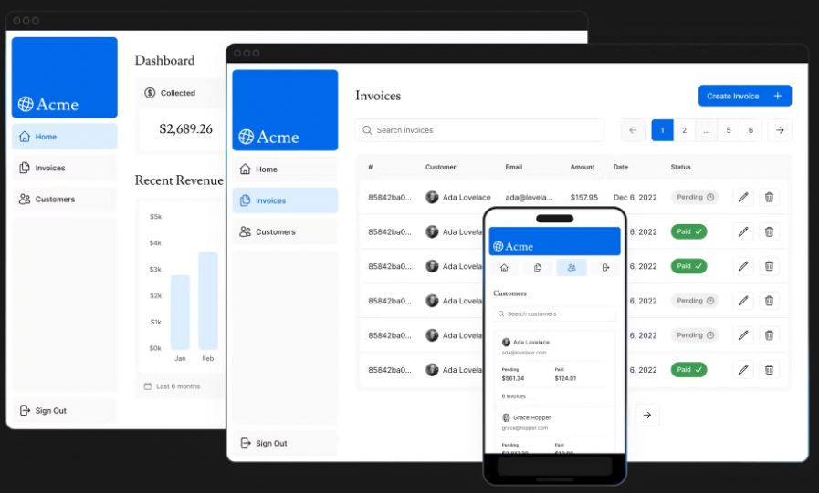
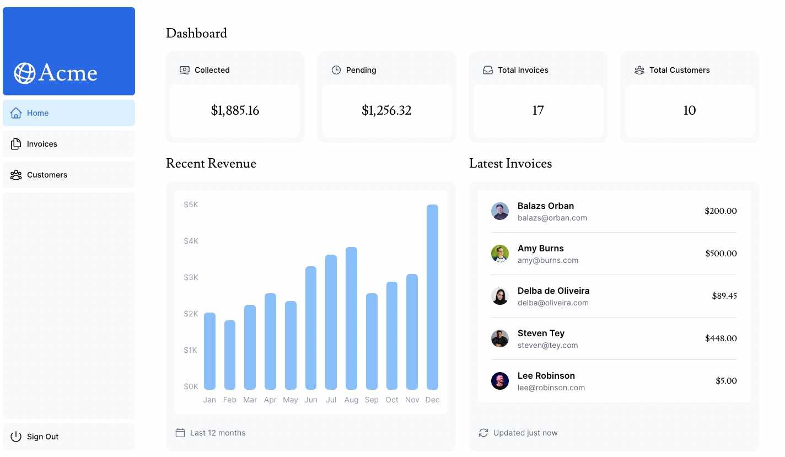

## Next.js App Dashboard Acme

This is simple full-stack web application using Next.js 14, Tailwhind and Typescript.

<p align="center">
  
</p>

The project contains:

- A public home page.
- A login page.
- 3 dashboard pages that are protected by authentication.


Access the dashboard by [clicking here](https://next-dashboard-three-pink.vercel.app/login) and using the following credentials:

```text
Email: user@nextmail.com
password: 123456
```

### Installing

Before running you will need:

- Node.js 18.17.0 or later installed. [Download here](https://nodejs.org/en).
- Github account;
- Vercel account;

Clone the project:

```
git clone https://github.com/msawaguchi/next-dashboard
cd next-dashboard
```

Install:

```
npm i
```

Create your ``.env`` and setup the PosgreSQL database by following the documentation: https://nextjs.org/learn/dashboard-app/setting-up-your-database

Run:

```
npm run dev
```

Done :rocket:

<p align="center">
  
</p>

Access https://nextjs.org/ to learn more about Next.js! 